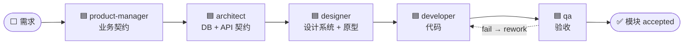
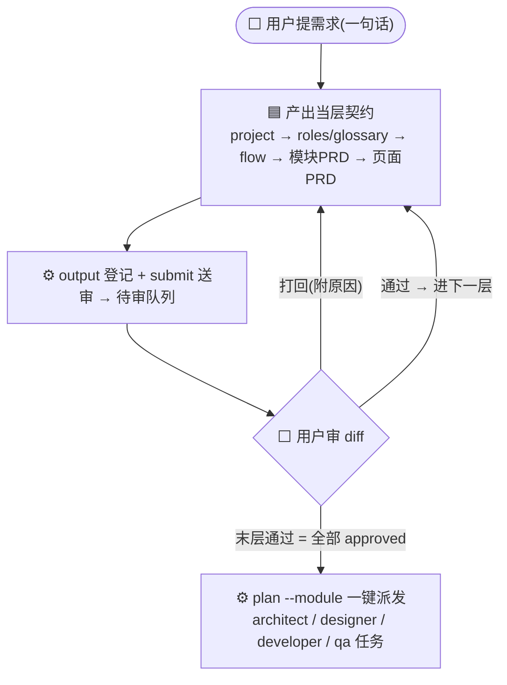
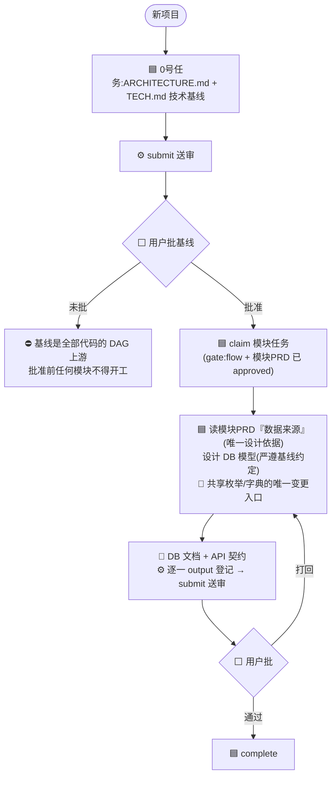
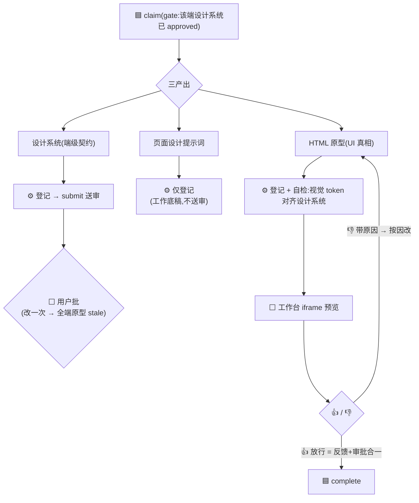
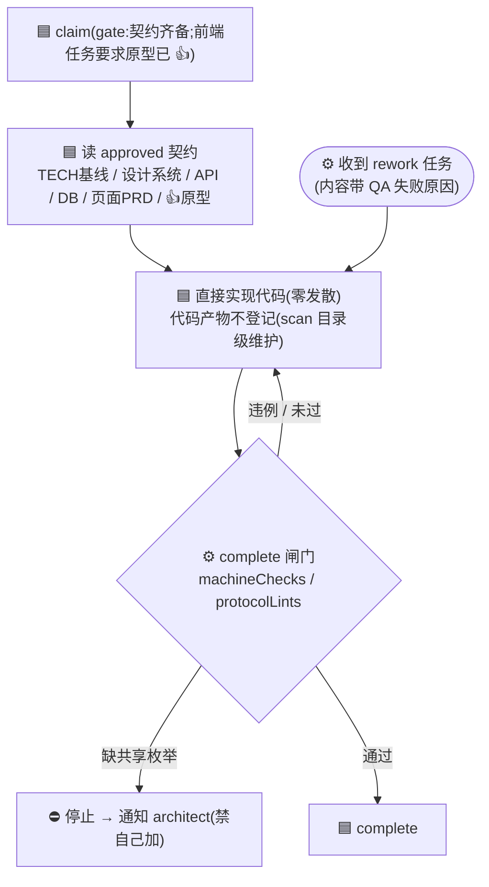
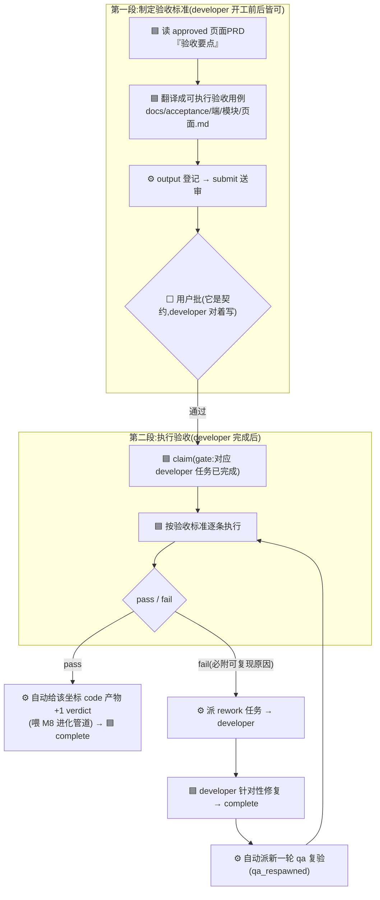

# workbench 五角色 Agent 流程图

> 每个 agent 一张独立流程图,讲清它**何时介入、消费什么、产出什么、怎么登记送审、有什么闭环**。
> 想看四方(人/AI/引擎/项目)如何协同,见 [COLLABORATION.md](COLLABORATION.md);完整教程见 [GETTING-STARTED.md](GETTING-STARTED.md)。
>
> **图例**:🟦 agent 动作 · ⬜ 用户动作(审批 / 👍) · ⚙️ 引擎自动 · 📄 产物 · ⛔ 阻断
>
> **贯穿所有 agent 的信任协议**:上游 `approved` = 真相直接用(禁重新推导);`draft/pending` = 可用但标注"未审";`invalidated / 复审中` = 禁用等复审;有实质异议走 `dispute` 留痕停下,不擅自偏离。

---

## 0. 流水线总览(五角色顺序 + 用户关卡)

每一环的产出都要**过用户关卡**(审批 diff / 原型 👍)才成为下游可信的真相。下面逐个拆开。

---

## 1. product-manager —— 逐层送审的业务契约

- **核心纪律:逐层确认制** —— 每层送审停下等审批,批准才进下一层;上层被打回,下层是废纸。
- flow 必含**实体状态机**(单一出现,页面 PRD 引用不复述);页面 PRD 必含**验收要点**(QA 只翻译不解释)。
- 边界:❌ 不写 API 路径 / 表结构 / 技术选型 / 未明示的功能。全 approved 才 `plan` 派发下游。

---

## 2. architect —— 业务契约 → 技术契约

- **0 号任务**:技术选型/目录/编码协议的基线,选型是用户的决策,architect 给方案不替拍板;**基线未批,没有"默认技术栈"**。
- **枚举唯一入口**:共享枚举只有 architect 能动,developer 缺枚举会停下等它——杜绝多端漂移。
- 文档即契约,schema 与文档必须同轮登记送审;developer 的 gate 等的就是这里的 `approved`。

---

## 3. designer —— 三产出走三条信任通道

- **三通道是核心**:设计系统走人工审批;提示词只登记不送审(人读渲染原型快过读文字);原型靠 **👍 = 反馈+审批合一**放行。
- 视觉 token 一律来自设计系统(不写死色值),否则设计系统失去立法效力。
- 原型未获 👍 就 complete 会收到信任警告。

---

## 4. developer —— approved = 直接实现,零发散

- **信任协议的核心消费者**:approved 契约直接实现,不发散不怀疑——这是与普通编码助手的本质区别。
- 硬边界:不自造 API、不偏离已 👍 原型、不违反基线/设计系统硬约束;契约有误走 `dispute` 不带病施工。
- 机器闸门(machineChecks/protocolLints)不过不许 complete;rework 任务修完由引擎自动派复验。

---

## 5. qa —— 两段式验收 + rework 自动闭环

- **判断权归 PM(定验收要点),执行权归 QA(定怎么验)** —— QA 只翻译不发明。
- **fail → rework → 复验自动循环到 pass,全程不消耗用户**;pass 自动转 +1 verdict 反哺进化管道。
- 人工走查发现验收标准未覆盖的缺陷:先补验收用例(重新送审)再记 fail —— 人工测试反哺用例,下轮自动覆盖。
- 引擎实现:验收执行/派 rework 在 `core/commands/qa.command.ts`,复验闭环在 `core/commands/task.commands.ts` 的 `spawnFollowupQa`。

---

*五张图共用同一套骨架:**claim(过 gate)→ 消费 approved 上游 → 产出 → 登记 → 送审/👍/验收 → 过用户关卡 → complete**。gate 与信任状态由引擎从文件内容派生,不靠人记。*
