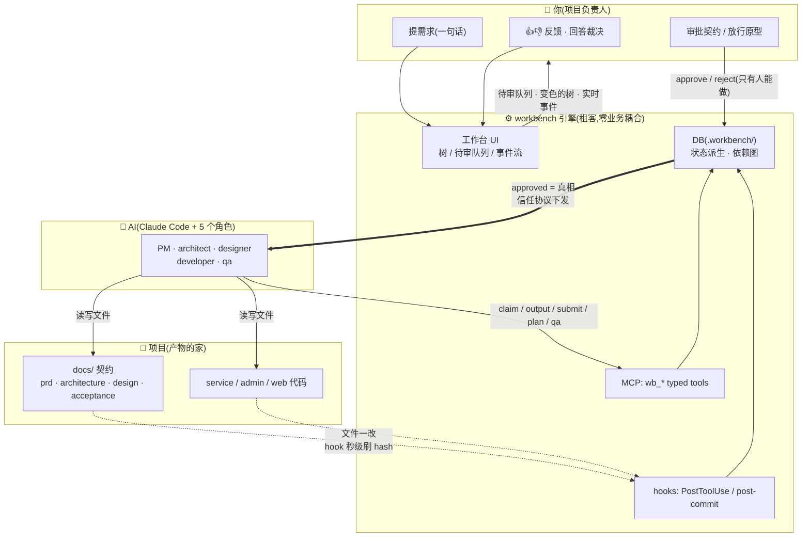
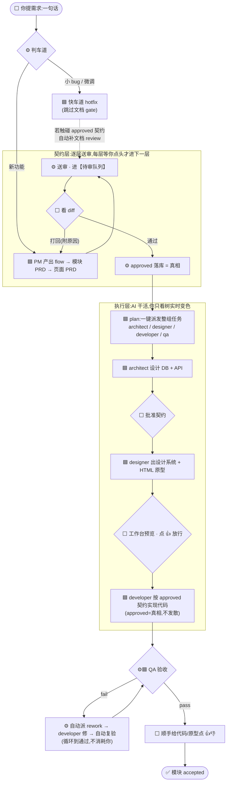
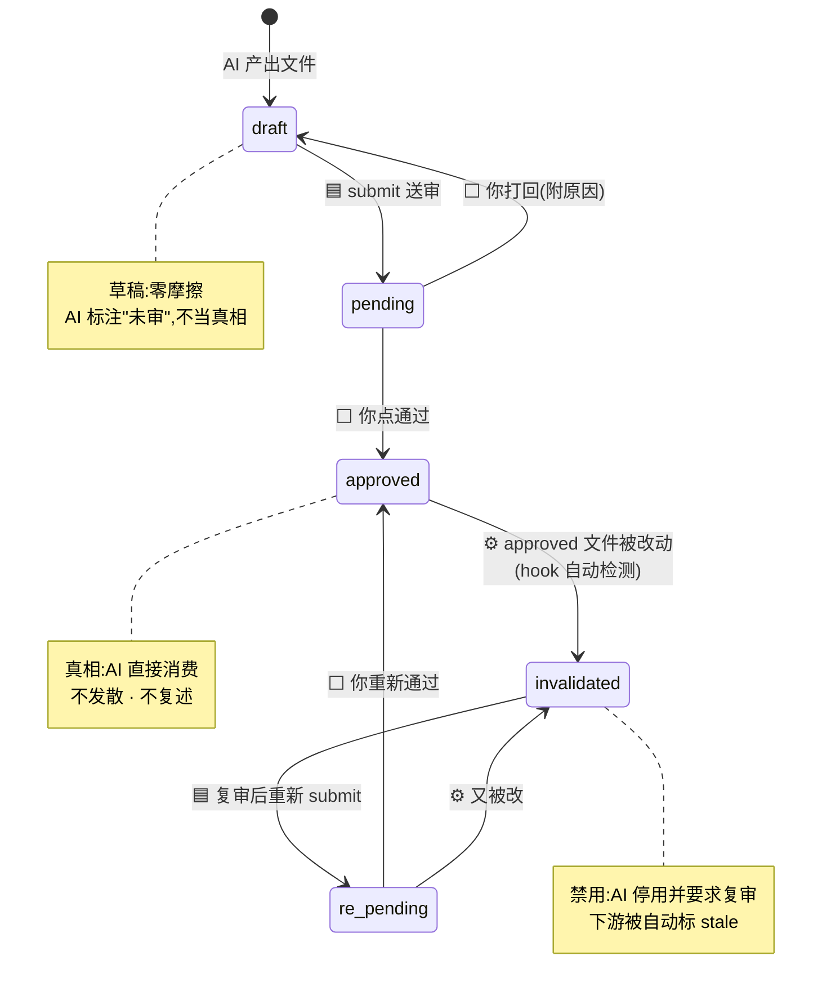
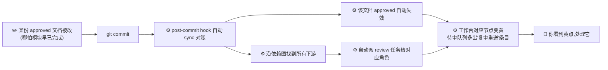
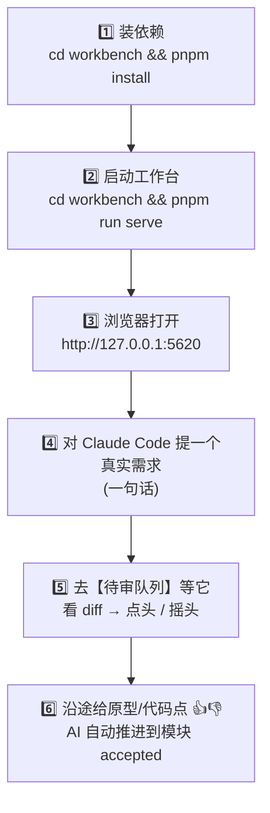

# workbench × 项目:协同流程图

> 这份文档只做一件事:用几张图,让**第一次接触 workbench 的人**看懂——
> workbench 这套引擎是怎么和你的**项目**(需求、契约文档、三端代码)协同起来的,
> 以及你坐下来之后**到底该做什么**。
>
> 想读文字版完整教程,看 [GETTING-STARTED.md](GETTING-STARTED.md)。这里是它的"地图"。

---

## 0. 一句话心智模型

**生成无限快,验证才是瓶颈。** 所以 workbench 把你的每一次验证(审批、👍👎、裁决)
铸成机器可读、可失效、可传播的资产,让 AI 千次消费零边际成本。

- **你**只做三件事:在待审队列点头/摇头、给产物点 👍👎、回答几个裁决。
- **AI**(Claude Code)干所有活:写文档、写代码、派任务、跑验收。
- **workbench 引擎**当裁判和记账员:盯着每个文件的状态,自动失效、自动派活、实时上屏。
- **项目**是产物本身:`docs/` 里的契约 + `service/admin/web` 的代码。

---

## 1. 四方协同全景图

谁和谁说话、数据往哪流——这张图是理解整套系统的总纲。

**读图要点**

- **审批(approve/reject)这条线只从"你"出发** —— 引擎刻意不把审批权暴露给 AI。
  这是整套系统的信任地基:AI 能提交,但"这份文档算不算真相"永远是你说了算。
- **AI 不直接改数据库** —— 它通过 `wb_*` MCP 工具登记动作,或直接改文件;
  文件一改,`hook` 自动把新 hash 写进 DB,工作台 2 秒内变色。你不用手动刷新。
- **`approved = 真相` 那条粗箭头** —— 一旦你批准,AI 后续直接把它当事实消费,
  不再回头找你确认,也不会自作主张偏离。这就是"信任协议"。

---

## 2. 一个需求的完整生命周期

以一个新功能需求为例——假设你对 AI 说"我要做用户可以收藏房源"。之后发生这些(⬜=你的动作,🟦=AI,⚙️=引擎自动):

**读图要点**

- **博弈全部前置到文档阶段。** 你在契约层多花几分钟看 diff,换来执行层的确定性机械执行。
  契约批准后,代码怎么写不再需要你逐行盯。
- **QA 的 fail→rework→复验是自动闭环** —— 不通过会自动派返工任务给 developer,修完自动复验,
  循环直到通过,**全程不消耗你**。
- **你的总介入** = 前端几次"看 diff 点头" + 沿途几次 👍👎 + 偶尔回答一个裁决。就这些。

---

## 3. 五态审批状态机(每份产物都在这张图上)

workbench 的核心不变量:**状态永远从文件内容派生,不落库**。文件一改,状态在数学上就变了——
没有"忘记更新状态"这种事。

> 举例:一份 PRD 获批(approved)后你改了它 → hook 检测到 hash 变化,它当即掉到 invalidated,
> 下游被自动标 stale;作者复审后重新 submit → re-pending(仍禁用,直到你重新通过)。
> 全程状态由文件内容派生,没有谁需要"记得去更新状态"。

---

## 4. 变更失效传播(这套系统最值钱的部分)

普通 AI 协作:改了一份文档,谁记得去更新依赖它的代码?**workbench:没人需要记得。**

**变更响应不依赖任何人"想起来"** —— 这是它和普通 AI 协作最本质的区别。改一处,受影响的
全链路自动亮黄灯排队等你。

---

## 5. 你在哪做这三个动作

| 你的动作 | 在哪做 | 什么时候 |
| --- | --- | --- |
| **审批契约** | 工作台【待审队列】看 diff → 通过 / trivial 通过 / 打回 | 队列出现新条目(有数字徽标) |
| **放行 / 反馈** | 产物查看器点 👍(原型=放行)/ 👎(必附原因) | 看到原型或代码时 |
| **回答裁决** | 直接对 AI(Claude Code)说 | AI 停下来问、或 dispute 留痕时 |

- **通过**:从此 AI 当真相直接用。别橡皮图章,但也不必逐字精读。
- **trivial 通过**:非破坏性小改——自动解除下游 stale、关闭已派 review,降摩擦。
- **打回**:必附原因(进事件流),对应 agent 照改重来。

---

## 6. 新手最小上手路径

第一次坐下来,按这个顺序走一遍就通了:

> ⚠️ 第 1 步的常见卡点:`better-sqlite3` 是原生模块,pnpm 11 默认拦截其构建脚本。
> 若 `serve` / `cli.ts` / MCP 起不来,多半是它没编译:`cd workbench && pnpm approve-builds`
> 勾选 better-sqlite3 后 `pnpm rebuild`,或改用 `npm install`。

---

## 7. 这套流程在你的项目里的落点

workbench 不绑定任何业务域或端划分——你在 `init --endpoints=...` 声明有哪些端,在
`workbench.config.json` 的 `codeRoots` 填每个端的代码目录约定(`{module}` 占位),角色流水线
按 `pipeline` 配置裁剪(纯后端项目自动去掉 designer,qa 保留)。举例:

| 端(示例) | 代码目录(`codeRoots`,你自己填) | 角色 |
| --- | --- | --- |
| **service** 接口端 | 如 `service/src/modules/{module}` | architect(DB+API)→ developer → qa |
| **admin** 管理后台 | 如 `admin/src/pages/{module}` | designer(原型)→ developer → qa |
| 前端端 | 如 `web/src/pages/{module}` | designer(原型)→ developer → qa |

契约的家(路径由 `config.docs` 决定,默认):`docs/prd/`(全景/角色/术语/flow/模块/页面)、
`docs/architecture/`(db/api)、`docs/design/`(系统/提示词/原型)、`docs/acceptance/`。

**技术栈由 architect 的 `ARCHITECTURE.md` + `TECH.md` 基线提案送审、经你批准后才定** ——
在基线批准前,业务代码不落地。这正是图 2「契约层先行」的第一道关。

---

*这份文档是 workbench 引擎自身的说明,和 [GETTING-STARTED.md](GETTING-STARTED.md) /
[README.md](README.md) 并列,不属于业务契约,不走审批流。*
