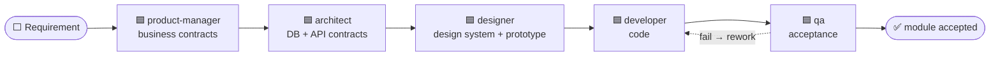

<div align="center">

# opcflow

**A drift-enforced, spec-anchored execution layer for AI coding.**

One template turns Claude Code / Codex / OpenCode / Cursor into a contract-governed, multi-role development pipeline.


[简体中文](README.md) · **English**


</div>

---

## What it is

Once generation is effectively free, **verification is the only bottleneck**. opcflow forges every
verification you make (approvals, 👍👎, rulings) into machine-readable, invalidatable, propagating
assets: docs → tasks → outputs form a real relationship graph (a DAG + foreign keys), and any change
**propagates along the chain and auto-dispatches re-reviews**. You do only three things: **approve
contracts, thumbs-up/down outputs, and answer rulings**.

- **Real relationship graph** — an artifact DAG + task foreign keys, not naming conventions
- **Five-state trust anchors** — editing approved content auto-invalidates it, downstream auto-goes-stale (state is derived from file content; nobody has to "update the status")
- **Five-role pipeline** — product-manager → architect → designer → developer → qa, each consuming approved upstream contracts, each with a gate
- **Change propagation** — `sync` reconciles → invalidate → dispatch review along the graph (deduped)
- **QA loop** — fail → auto rework → auto re-verify, no human in the loop
- **Write-gate hooks** — block agents from editing an approved contract (observe mode by default)
- **Feedback evolution** — 👍👎 and QA verdicts, half-life weighted → candidates (AI decides skill / rule / memory) / Red Flags
- **Multi-platform** — one definition generates each platform's agent + MCP + hooks (see [PLATFORMS.md](PLATFORMS.md))
- **Visual opcflow** — tree + markdown/mermaid/prototype/code rendering + review-queue diff + live SSE

## Difference from GitHub Spec Kit

[Spec Kit](https://github.com/github/spec-kit) is a scaffold for spec-driven development: `/specify →
/plan → /tasks → implement`, where each phase produces a markdown artifact that feeds the next,
giving the agent **structured context** instead of ad-hoc prompts. It solves "**how to write a good
spec before handing it to an agent**."

opcflow takes over **execution and verification after the spec**. The two are different layers and
complementary:

| | Spec Kit | opcflow |
| --- | --- | --- |
| Role of the spec | **One-shot context** for the agent (markdown) | A machine-enforced **approved contract**; a DAG node |
| Approval | No enforced state; a human reads it | Five-state trust anchor (draft/pending/approved/invalidated), machine-derived |
| After the spec changes | No linkage; humans must remember to sync | **Auto-invalidate + downstream stale + dispatch review** |
| Roles | Essentially single-flow (one agent implements) | Five-role pipeline, each with its own gate and output channel |
| Construction constraints | The spec is advisory | Gates block tasks whose upstream isn't approved; write-gate blocks edits to approved contracts; protocol lints as checkpoints |
| Acceptance | Not covered | Two-stage QA + fail→rework→re-verify auto loop |
| Evolution | Not covered | 👍👎/verdict half-life weighting → candidates (skill/rule/memory) / Red Flags |

In one line: **Spec Kit treats the spec as "context for the agent"; opcflow treats it as "an
approved contract that can go stale, propagate, and block construction," and governs the entire drift
from contract to code to acceptance.**

## Installation

opcflow is an npm package — it **does not drop source into your project**. Install it once globally to
get the `opcflow` command:

```bash
pnpm i -g @dawipong/opcflow      # or npm i -g @dawipong/opcflow
```

Bootstrap from your project root (no args → interactive: pick platforms / endpoints / model; or pass flags):

```bash
opcflow init --platforms=claude,cursor --endpoints=service,web
#   backend-only:  --endpoints=service          (auto-prunes designer, qa kept)
#   set models:    --model='{"codex":"gpt-5.1-codex"}'  or  --model=<single string> (defaults per platform)
```

It writes only **generated artifacts** — each platform's agent definitions, MCP registration, hooks,
`workbench.config.json`, the `docs/` skeleton, and the `.workbench/` database; **no opcflow source**.
The generated MCP / hook / CLI references all point at `npx -y @dawipong/opcflow <subcommand>`, so no
reinstall across machines or teammates. `--platforms` defaults to `claude`.

> Per-platform layout, Codex trust, Cursor main-agent model, etc. — see **[PLATFORMS.md](PLATFORMS.md)**.

Requires Node ≥ 22.

## Quick Start

1. **Fill in code-dir conventions** — edit `codeRoots` in `workbench.config.json` (each endpoint's code dir, `{module}` placeholder).
2. **Start the opcflow** (visual approval panel, connects to the project's `.workbench`):
   ```bash
   opcflow serve       # → http://127.0.0.1:5620 (--project sets the root, defaults to cwd)
   ```
3. **Give the AI your first requirement** (one sentence). It runs the five-role pipeline, producing contracts layer by layer and submitting them for review.
4. **Nod in the review queue** — view diffs in the opcflow; approve / reject; thumbs-up prototypes.
5. **Once all contracts are approved, dispatch:**
   ```bash
   opcflow plan --module=<module>   # dispatch architect/designer/developer/qa tasks
   ```

Every later change is tracked: edit an approved contract → auto-invalidate → downstream stale → a
re-review task appears in the queue.

## Agent Authoring Flow (five-role pipeline)



> 🟦 agent action · ⬜ user gate (approval / 👍) · ⚙️ engine-automatic. Every output must **pass a user
> gate** before it becomes trusted truth for downstream. All agents share one skeleton: **claim (pass
> the gate) → consume approved upstream → produce → register → submit/👍/accept → pass the gate →
> complete**.

**The trust protocol, everywhere**: upstream `approved` = truth, use it directly (**no re-derivation, no
re-confirming**); `draft/pending` = usable but flagged "unreviewed"; `invalidated / under re-review` =
**forbidden**, wait for re-review; on a substantive objection, use `dispute` to leave a trace and stop —
never silently deviate.

| Role | When it enters / gate | Produces | How it becomes truth |
| --- | --- | --- | --- |
| **product-manager** | user gives a requirement | layered business contracts: project → roles/glossary → flow (with entity state machine) → module PRD → page PRD (with acceptance points) | submit layer by layer; **approval required to advance**; all approved → `plan` dispatches |
| **architect** | gate: flow + module PRD approved | tech baseline (ARCHITECTURE/TECH, task #0), DB docs, API contracts; **sole owner of shared enums** | human approval; no module may start before the baseline is approved |
| **designer** | gate: that endpoint's design system approved | design system (human-reviewed), design prompts (registered only, not submitted), HTML prototype | prototype released via **👍 = feedback + approval combined** |
| **developer** | gate: contracts in place; frontend tasks require a 👍'd prototype | code per endpoint (maintained by directory-level scan, not manually registered) | complete gate: machineChecks / protocolLints pass |
| **qa** | two-stage: define acceptance criteria first (submit), then run after developer completes | acceptance cases (`docs/acceptance/...`), pass/fail | pass → +1 verdict on the code; **fail → auto rework → auto re-verify** until pass |

> **Two ways to produce the HTML prototype**: by default the currently connected model produces it
> directly; or hand the approved **design system** + **page design prompts** to a third-party design
> platform (e.g. v0, Lovable) to generate the HTML, then drop the file into the matching path
> `docs/design/prototypes/<endpoint>/<module>/<page>.html` — once `scan` registers it, it goes through
> the usual 👍 release. Both paths are equivalent in the system; both must pass a user 👍.

## CLI Commands

`opcflow <command> [args]` (after a global install; or `npx -y @dawipong/opcflow <command>` without installing). Approval actions (approve/reject) are human-only; the AI uses the MCP `wb_*` typed tools.

**Each command's purpose, when to use it, and parameters are in [COMMANDS.en.md](COMMANDS.en.md).** At a glance:

- **Tasks** `list` · `show` · `create` · `claim` · `update` · `remove` · `record` · `input`
- **Outputs** `output` · `artifacts` · `scan` · `move`
- **Trust** `submit` · `approve` · `reject` · `feedback` · `dispute` · `queue` · `sync`
- **Flow** `plan` · `qa` · `audit` · `graph` · `lint` · `events` · `intake`
- **Evolution / Maintenance** `retro` · `export` · `init` · `gen-agents` · `register-meta` · `install-hooks` · `migrate`
- **Service & Integration** `serve` · `mcp` · `hook` · `postcommit` (mostly auto-invoked by platform / git)

## Configuration (workbench.config.json)

Generated by `init`, hand-edited afterwards — each project's coordinate system and discipline switches. **Every field's purpose, default, and when to tune it is in [CONFIG.en.md](CONFIG.en.md).**

```jsonc
{
  "platforms": ["claude", "cursor"],          // target platforms
  "endpoints": ["service", "web"],            // your endpoints
  "pipeline": ["product-manager", "architect", "designer", "developer", "qa"],
  "codeRoots": { "service": ["service/src/modules/{module}"] },  // [required] code dir per endpoint, {module} placeholder
  "gates": { "approvalMode": "warn", "writeGate": "observe" }    // approval / write-gate discipline levels
}
```

## Visual opcflow

`opcflow serve` serves at `http://127.0.0.1:5620`: the artifact tree (colors update live), markdown /
mermaid / HTML-prototype iframe / code rendering, the **review-queue diff** (approved version vs.
current), an event timeline, and live SSE refresh. Approve, reject, and thumbs-up/down prototypes right
here.

## Scripts

```bash
pnpm run web:build        # build the frontend (required before first serve, else web/dist is missing → 404)
pnpm exec tsx cli.ts serve  # start the workbench from source → http://127.0.0.1:5620
pnpm test                 # core unit tests
pnpm run typecheck        # type check
pnpm run check:isolation  # zero business-coupling check
```

## Tech Stack

TypeScript · better-sqlite3 · Fastify · React 18 + antd 6 · Monaco · mermaid ·
@modelcontextprotocol/sdk · smol-toml · tsx. Runtime Node ≥ 22.

## License

[MIT](LICENSE)
