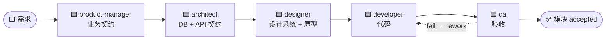

<div align="center">

# opcflow

**Drift-enforced、spec-anchored 的 AI 开发执行层。**

一套模板,把 Claude Code / Codex / OpenCode / Cursor 变成受契约约束的多角色开发流水线。


**简体中文** · [English](README.en.md)


</div>

---

## 这是什么

生成无限快之后,**验证是唯一瓶颈**。opcflow 把你的每一次验证(审批、👍👎、裁决)铸成
机器可读、可失效、可传播的资产:文档 → 任务 → 产出形成真实的关系链(DAG + 外键),任何一处
变更都**自动沿链传播、自动派复审**。你只做三件事:**审批契约、给产物点 👍👎、回答裁决**。

- **真实关系链** —— artifact DAG + 任务外键,不是命名约定
- **五态信任锚点** —— approved 内容被改自动失效,下游自动 stale(状态由文件内容派生,无需谁去"更新状态")
- **五角色流水线** —— product-manager → architect → designer → developer → qa,各消费上游 approved 契约,各有 gate
- **变更传播** —— `sync` 对账 → 失效 → 沿图派 review(去重)
- **QA 闭环** —— fail → 自动 rework → 自动复验,不消耗人
- **写门禁 hooks** —— agent 改到已 approved 契约时拦截(默认 observe 观察期)
- **反馈进化** —— 👍👎 与 QA verdict 半衰期加权 → 经验候选(由 AI 判断沉淀为 skill / 规则 / 记忆)/ Red Flags
- **多平台** —— 一套定义生成四家平台各自的 agent + MCP + hooks(见 [PLATFORMS.md](PLATFORMS.md))
- **可视化工作台** —— 树 + markdown/mermaid/原型/代码渲染 + 待审队列 diff + SSE 实时

## 与 GitHub Spec Kit 的区别

[Spec Kit](https://github.com/github/spec-kit) 是 spec-driven development 的脚手架:`/specify → /plan
→ /tasks → implement`,每个阶段产出一份 markdown 喂给下一阶段,给 agent **结构化上下文**而非
临时提示词。它解决的是「**如何写出好 spec 再交给 agent**」。

opcflow 接管 **spec 之后的执行与验证**,两者是不同层次、可互补:

| | Spec Kit | opcflow |
| --- | --- | --- |
| spec 的角色 | 给 agent 的**一次性上下文**(markdown) | 机器强制的**已批契约**,是 DAG 节点 |
| 审批 | 无强制状态;人读一读 | 五态信任锚点(draft/pending/approved/invalidated),机器派生 |
| 改了 spec 之后 | 无联动,靠人记得同步 | **自动失效 + 下游 stale + 派复审** |
| 角色 | 基本单流程(一个 agent 实现) | 五角色流水线,各有 gate 与产出通道 |
| 施工约束 | spec 是建议 | gate 拦住上游未批的任务;写门禁拦改已批契约;协议 lint 卡点 |
| 验收 | 不涉及 | 两段式 QA + fail→rework→复验自动闭环 |
| 进化 | 不涉及 | 👍👎/verdict 半衰期加权 → 经验候选(skill/规则/记忆)/ Red Flags |

一句话:**Spec Kit 把 spec 当"给 agent 的上下文";opcflow 把 spec 当"会失效、会传播、卡得住施工
的已批契约",并管住从契约到代码到验收的整条漂移。**

## 安装

opcflow 是一个 npm 包 —— **不往你的项目里塞源码**。全局装一次,拿到 `opcflow` 命令:

```bash
pnpm i -g @dawipong/opcflow      # 或 npm i -g @dawipong/opcflow
```

在你的项目根一键引导(不带参数进交互:选平台 / 端 / 模型;也可用参数直接指定):

```bash
opcflow init --platforms=claude,cursor --endpoints=service,web
#   纯后端:      --endpoints=service          (自动裁掉 designer,qa 保留)
#   指定模型:    --model='{"codex":"gpt-5.1-codex"}'  或  --model=<单个串>(缺省用各平台默认)
```

它只往项目写**生成物** —— 各平台 agent 定义、MCP 注册、hooks、`workbench.config.json`、`docs/` 骨架、
数据库 `.workbench/`;**不落任何 opcflow 源码**。生成的 MCP / hook / CLI 引用统一指向
`npx -y @dawipong/opcflow <子命令>`,换机器 / 团队协作免重装。`--platforms` 缺省 `claude`。

> 各平台落地格式、Codex trust、Cursor 主 agent 模型等注意点见 **[PLATFORMS.md](PLATFORMS.md)**。

需要 Node ≥ 22。

## 快速开始

1. **填代码目录约定** —— 编辑 `workbench.config.json` 的 `codeRoots`(每个端的代码目录,`{module}` 占位)。
2. **起工作台**(可视化审批面板,连接项目的 `.workbench`):
   ```bash
   opcflow serve       # → http://127.0.0.1:5620(--project 指定项目根,缺省 cwd)
   ```
3. **对 AI 提第一个需求**(一句话)。它走五角色流水线逐层产出契约并送审。
4. **在待审队列点头** —— 工作台看 diff,approve / 打回 / 给原型 👍。
5. **契约全 approved 后派发**:
   ```bash
   opcflow plan --module=<模块>   # 一键派发 architect/designer/developer/qa 任务
   ```

之后的每次改动都被追踪:改了已批契约 → 自动失效 → 下游 stale → 待审队列出现复审任务。

## Agent 写作流程(五角色流水线)



> 🟦 agent 动作 · ⬜ 用户关卡(审批 / 👍) · ⚙️ 引擎自动。每一环的产出都要**过用户关卡**才成为
> 下游可信真相。所有 agent 共用一套 **claim(过 gate)→ 消费 approved 上游 → 产出 → 登记 → 送审/👍/验收
> → 过关卡 → complete** 的骨架。

**贯穿的信任协议**:上游 `approved` = 真相直接用(**禁重新推导、禁重复确认**);`draft/pending` = 可用但
标注"未审";`invalidated / 复审中` = **禁用**等复审;有实质异议走 `dispute` 留痕停下,不擅自偏离。

| 角色 | 何时介入 / gate | 产出 | 怎么成为真相 |
| --- | --- | --- | --- |
| **product-manager** | 用户提需求 | 逐层业务契约:project → roles/glossary → flow(含实体状态机)→ 模块 PRD → 页面 PRD(含验收要点) | 逐层送审,**批准才进下一层**;末层全批 → `plan` 派发 |
| **architect** | gate:flow + 模块 PRD 已批 | 技术基线(ARCHITECTURE/TECH,0 号任务)、DB 文档、API 契约;**共享枚举唯一变更入口** | 人工审批;基线未批任何模块不得开工 |
| **designer** | gate:该端设计系统已批 | 设计系统(人审)、设计提示词(仅登记不送审)、HTML 原型 | 原型靠 **👍 = 反馈+审批合一**放行 |
| **developer** | gate:契约齐备;前端任务要求原型已 👍 | 各端代码(目录级 scan 维护,不手动登记) | complete 闸门:machineChecks / protocolLints 通过 |
| **qa** | 两段式:先定验收标准(送审),developer 完成后执行 | 验收用例(`docs/acceptance/...`)、pass/fail | pass → 给 code +1 verdict;**fail → 自动 rework → 自动复验**直到 pass |

> **HTML 原型的两种产出方式**:默认由当前接入的模型直接产出;也可把 approved 的**设计系统** +
> **页面设计提示词**交给第三方设计平台(如 v0、Lovable 等)生成 HTML,再把产物文件丢到对应路径
> `docs/design/prototypes/<端>/<模块>/<页面>.html`,`scan` 登记后照常走 👍 放行——两条路径产出的原型
> 在体系里等价,都要过用户 👍。

## CLI 命令

`opcflow <命令> [参数]`(全局装后即用;或 `npx -y @dawipong/opcflow <命令>` 免装)。审批类动作(approve/reject)只给人,AI 侧走 MCP 的 `wb_*` typed tools。

**每条命令的作用、使用场景与参数见 [COMMANDS.md](COMMANDS.md)。** 速览:

- **任务** `list` · `show` · `create` · `claim` · `update` · `remove` · `record` · `input`
- **产出** `output` · `artifacts` · `scan` · `move`
- **信任** `submit` · `approve` · `reject` · `feedback` · `dispute` · `queue` · `sync`
- **流程** `plan` · `qa` · `audit` · `graph` · `lint` · `events` · `intake`
- **进化 / 维护** `retro` · `export` · `init` · `gen-agents` · `register-meta` · `install-hooks` · `migrate`
- **服务与集成** `serve` · `mcp` · `hook` · `postcommit`(多由平台 / git 自动调用)

## 配置(workbench.config.json)

`init` 生成、之后手工编辑,是每个项目的坐标系与纪律开关。**每个字段的作用、默认值与何时调,见 [CONFIG.md](CONFIG.md)。**

```jsonc
{
  "platforms": ["claude", "cursor"],          // 目标平台
  "endpoints": ["service", "web"],            // 你的端
  "pipeline": ["product-manager", "architect", "designer", "developer", "qa"],
  "codeRoots": { "service": ["service/src/modules/{module}"] },  // 【必填】每端代码目录,{module} 占位
  "gates": { "approvalMode": "warn", "writeGate": "observe" }    // 审批 / 写门禁纪律档位
}
```

## 可视化工作台

`opcflow serve` 起在 `http://127.0.0.1:5620`:artifact 树(状态实时变色)、markdown / mermaid / HTML 原型
iframe / 代码渲染、**待审队列 diff**(approved 版本 vs 当前)、事件时间线、SSE 实时刷新。审批、打回、
给原型 👍👎 都在这里点。

## 脚本

```bash
pnpm run web:build        # 构建前端(工作台首次运行前需先构建,否则 web/dist 未生成会 404)
pnpm exec tsx cli.ts serve  # 从源码起工作台 → http://127.0.0.1:5620
pnpm test                 # core 单元测试
pnpm run typecheck        # 类型检查
pnpm run check:isolation  # 零业务耦合校验
```

## 技术栈

TypeScript · better-sqlite3 · Fastify · React 18 + antd 6 · Monaco · mermaid ·
@modelcontextprotocol/sdk · smol-toml · tsx。运行时 Node ≥ 22。

## 许可

[MIT](LICENSE)
